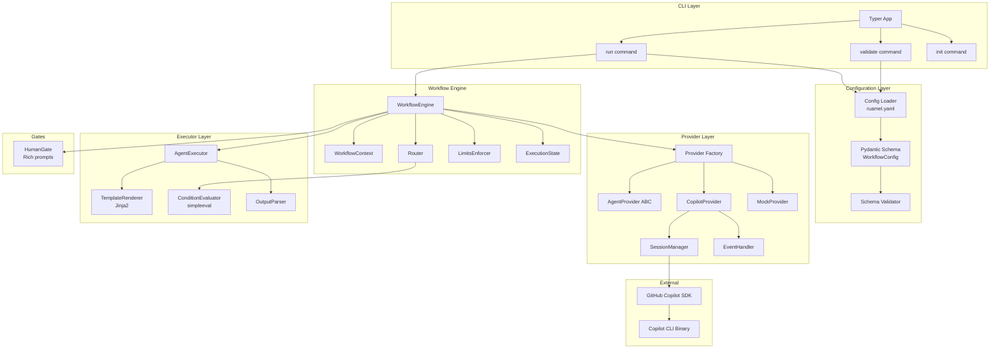
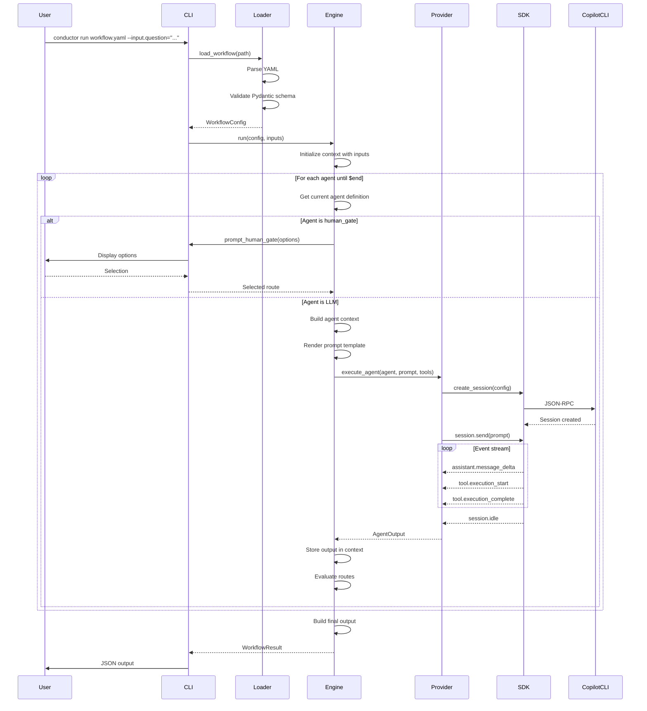

# Copilot Conductor - Solution Design

## Related Documents

| Type | Document |
|------|----------|
| Requirements | [copilot-conductor.brainstorm.md](./copilot-conductor.brainstorm.md) |
| Implementation Plan | TBD |

---

## 1. Problem Statement

Organizations increasingly need to orchestrate complex multi-agent AI workflows where multiple specialized agents collaborate to solve problems. Current approaches require either:

1. **Custom code for each workflow**: Writing Python/TypeScript code to chain agent calls, manage context, handle errors, and implement routing logic.
2. **Low-code platforms with vendor lock-in**: Tools like Langflow or Flowise that are GUI-based and not suitable for CLI-first, version-controlled workflows.
3. **Manual prompt engineering**: Relying on a single agent to handle everything, leading to poor separation of concerns and unreliable outputs.

**Pain Points:**
- No declarative way to define multi-agent workflows that can be version-controlled
- Context passing between agents requires custom code
- Conditional routing and loops are difficult to implement reliably
- Human-in-the-loop gates require building custom UIs
- No easy way to test, validate, or dry-run workflows before execution
- Tight coupling to specific LLM providers/SDKs

**Gap:** There is no CLI-first, YAML-based tool for defining and running multi-agent workflows that integrates natively with the GitHub Copilot SDK while maintaining provider abstraction for future flexibility.

## 2. Goals and Non-Goals

### Goals

- **GOAL-001**: Enable declarative workflow definitions in YAML that can be version-controlled alongside code
- **GOAL-002**: Support context passing between agents with configurable accumulation strategies
- **GOAL-003**: Implement conditional routing based on agent outputs with first-match semantics
- **GOAL-004**: Provide iteration limits and timeouts to prevent runaway workflows
- **GOAL-005**: Support human-in-the-loop approval gates with interactive CLI prompts
- **GOAL-006**: Integrate with GitHub Copilot SDK as the primary provider
- **GOAL-007**: Maintain provider abstraction to enable future SDK integrations
- **GOAL-008**: Distribute via `uvx`/`pipx` for zero-friction installation
- **GOAL-009**: Validate workflow configurations before execution with helpful error messages
- **GOAL-010**: Support tool integration via SDK-resolved tool definitions

### Non-Goals

- **NON-GOAL-001**: GUI or web interface - this is a CLI-only tool
- **NON-GOAL-002**: Agent training or fine-tuning capabilities
- **NON-GOAL-003**: Custom model hosting - uses SDK-provided models only
- **NON-GOAL-004**: Implementing providers beyond Copilot SDK in v1.0 (abstraction exists for future)
- **NON-GOAL-005**: Real-time collaboration or multi-user workflows
- **NON-GOAL-006**: Workflow versioning/migration tooling (beyond simple schema validation)

## 3. Requirements

### Functional Requirements

- **REQ-001**: Parse YAML workflow configurations with full schema validation using Pydantic v2
- **REQ-002**: Execute workflows starting from a defined entry point agent
- **REQ-003**: Render Jinja2 templates in prompts with access to workflow inputs and agent outputs
- **REQ-004**: Evaluate routing conditions using a safe expression evaluator (simpleeval)
- **REQ-005**: Accumulate context between agent executions with configurable strategies (accumulate, last_only, explicit)
- **REQ-006**: Enforce iteration limits (default: 10) and timeout limits (default: 600s)
- **REQ-007**: Handle `$end` routing target to terminate workflow and produce final output
- **REQ-008**: Support `human_gate` agent type for interactive approval prompts
- **REQ-009**: Pass tool definitions to SDK and handle tool execution events
- **REQ-010**: Provide `validate` command to check workflow syntax without execution
- **REQ-011**: Provide `run` command with `--input.<name>=<value>` flag pattern
- **REQ-012**: Provide `init` command to scaffold new workflows from templates
- **REQ-013**: Support `--dry-run` flag to show execution plan without running
- **REQ-014**: Support `--skip-gates` flag to auto-approve human gates
- **REQ-015**: Support environment variable interpolation in model names (e.g., `${MODEL:-default}`)
- **REQ-016**: Produce structured JSON output matching the workflow's `output` schema

### Non-Functional Requirements

- **NFR-001**: CLI response time < 500ms for `validate` command on typical workflows
- **NFR-002**: Support Python 3.12+ only (modern type hints, pattern matching)
- **NFR-003**: Zero external dependencies beyond Python and Copilot CLI binary
- **NFR-004**: Memory footprint < 100MB for typical workflow execution
- **NFR-005**: All code passes ruff lint checks and ty type checking
- **NFR-006**: Test coverage > 80% for core modules (engine, config, executor)
- **NFR-007**: Graceful handling of Copilot CLI connection failures with retry logic
- **NFR-008**: Clear error messages with file location and suggested fixes

## 4. Solution Architecture

### 4.1 Overview

Copilot Conductor follows a layered architecture separating concerns across CLI, configuration, engine, providers, and executors:

1. **CLI Layer (Typer)**: Parses commands and flags, handles user interaction for human gates
2. **Config Layer (Pydantic)**: Loads YAML, validates schema, resolves environment variables
3. **Engine Layer**: Orchestrates workflow execution, manages state, evaluates routing
4. **Provider Layer**: Abstracts SDK communication, handles event-driven session management
5. **Executor Layer**: Renders templates, executes agents, parses outputs

**Key Design Decisions:**

1. **Event-Driven SDK Adaptation**: The GitHub Copilot SDK uses an event-driven, session-based architecture (not simple request/response). The `CopilotProvider` wraps this with `asyncio.Event` synchronization to provide a simple `execute_agent()` interface.

2. **Discriminated Unions for Agent Types**: Using Pydantic v2 discriminated unions allows type-safe handling of `llm` vs `human_gate` agent types.

3. **Separated Evaluators**: Template rendering (Jinja2) and condition evaluation (simpleeval) are separate components to prevent injection attacks and enable independent testing.

4. **Immutable Context**: The `WorkflowContext` accumulates outputs immutably, enabling replay and debugging.

### 4.2 Component Diagram



### 4.3 Key Components

| Component | Responsibility | Technology |
|-----------|----------------|------------|
| `cli/app.py` | Main Typer application with command registration | Typer 0.21+ |
| `cli/commands/run.py` | Execute workflow with inputs, handle streaming output | Typer, Rich |
| `cli/commands/validate.py` | Validate workflow YAML without execution | Pydantic |
| `cli/commands/init.py` | Scaffold new workflow from templates | Jinja2 |
| `config/loader.py` | Load YAML, resolve env vars, parse into models | ruamel.yaml |
| `config/schema.py` | Pydantic models for workflow configuration | Pydantic v2 |
| `config/validation.py` | Cross-field validation (e.g., route targets exist) | Pydantic validators |
| `engine/workflow.py` | Main execution loop, orchestrates components | asyncio |
| `engine/context.py` | Immutable context accumulation and retrieval | dataclasses |
| `engine/router.py` | Evaluate routes, determine next agent | simpleeval |
| `engine/limits.py` | Enforce iteration/timeout limits | asyncio |
| `engine/state.py` | Track execution state for debugging/replay | dataclasses |
| `providers/base.py` | `AgentProvider` abstract base class | ABC |
| `providers/factory.py` | Create provider instances based on config | Factory pattern |
| `providers/copilot/provider.py` | Copilot SDK integration with event handling | github-copilot-sdk |
| `providers/copilot/session.py` | Manage Copilot sessions lifecycle | asyncio |
| `providers/copilot/events.py` | Handle SDK events, accumulate responses | Event handlers |
| `providers/mock.py` | Mock provider for testing | pytest fixtures |
| `executor/agent.py` | Coordinate template rendering and execution | async/await |
| `executor/template.py` | Jinja2 template rendering with filters | Jinja2 |
| `executor/conditions.py` | Safe condition evaluation | simpleeval |
| `executor/output.py` | Parse and validate structured outputs | JSON, Pydantic |
| `gates/human.py` | Interactive CLI prompts for human gates | Rich |
| `errors.py` | Custom exception hierarchy | Python exceptions |

### 4.4 Data Flow



### 4.5 API Contracts

#### 4.5.0 Expression Evaluation Strategy

> **Design Decision**: The brainstorm uses `{{ }}` syntax for both prompts and routing conditions. This design clarifies the evaluation pipeline:

**Two-Phase Evaluation:**

1. **Template Rendering (Jinja2)**: Used for prompts and output transformations
   - Input: `{{ answerer.output.claims | json }}`
   - Output: Rendered string with values substituted

2. **Condition Evaluation (simpleeval)**: Used for routing `when` conditions
   - Input: `{{ output.all_correct }}` or `output.all_correct`
   - Process: Strip `{{ }}` wrappers if present, evaluate as Python-like expression
   - Output: Boolean result

```python
class ConditionEvaluator:
    def evaluate(self, expression: str, context: dict) -> bool:
        """Evaluate routing conditions safely."""
        # Strip {{ }} wrappers if present (YAML authors can use either style)
        expr = expression.strip()
        if expr.startswith("{{") and expr.endswith("}}"):
            expr = expr[2:-2].strip()
        
        # Safe evaluation with simpleeval
        return simple_eval(expr, names=context)
```

**Security Note:** Both Jinja2 and simpleeval are sandboxed. Jinja2 uses `SandboxedEnvironment` and simpleeval restricts operations to safe primitives.

#### 4.5.1 AgentProvider Interface

> **Design Decision**: The `AgentOutput` dataclass includes additional fields (`tool_calls`, `usage`) not in the original brainstorm. This enhancement supports observability and debugging requirements.

```python
from abc import ABC, abstractmethod
from dataclasses import dataclass
from typing import Any

from copilot_conductor.config.schema import AgentDef, RuntimeConfig, ToolDef


@dataclass
class AgentOutput:
    """Normalized output from any provider."""
    content: dict[str, Any]      # Parsed structured output
    raw_response: str            # Raw text response for debugging
    tool_calls: list[dict]       # Tool executions that occurred
    usage: dict[str, int] | None # Token usage if available


class AgentProvider(ABC):
    """Abstract base class for SDK providers."""
    
    @abstractmethod
    async def initialize(self, config: RuntimeConfig) -> None:
        """Initialize the provider (start client, establish connection)."""
        ...
    
    @abstractmethod
    async def execute_agent(
        self,
        agent: AgentDef,
        rendered_prompt: str,
        system_prompt: str | None = None,
        tools: list[ToolDef] | None = None,
        output_schema: dict[str, Any] | None = None,
    ) -> AgentOutput:
        """
        Execute a single agent turn and await structured output.
        
        The provider is responsible for:
        1. Creating/reusing a session
        2. Sending the prompt
        3. Handling all events until session.idle
        4. Parsing structured output from response
        5. Returning normalized AgentOutput
        """
        ...
    
    @abstractmethod
    async def close(self) -> None:
        """Clean up resources (destroy sessions, stop client)."""
        ...
```

#### 4.5.2 WorkflowConfig Schema (Pydantic)

> **Design Decision**: The brainstorm document used `type: Literal["", "human_gate"] | None` for agent discrimination. This design refines that to use Pydantic v2 discriminated unions with explicit `"llm"` type for better type safety and cleaner pattern matching.

```python
from typing import Annotated, Any, Literal
from pydantic import BaseModel, Field


# Supporting types
class OutputField(BaseModel):
    type: Literal["string", "number", "boolean", "array", "object"]
    description: str | None = None
    items: "OutputField | None" = None  # For arrays
    properties: dict[str, "OutputField"] | None = None  # For objects
    required: list[str] | None = None
    enum: list[Any] | None = None


class RouteDef(BaseModel):
    to: str
    when: str | None = None
    output: dict[str, str] | None = None


class GateOption(BaseModel):
    label: str
    value: str
    route: str
    prompt_for: str | None = None


class ToolDef(BaseModel):
    """Tool definition passed to the SDK. Tools are resolved by name via the SDK."""
    name: str
    description: str | None = None


# Runtime configuration
class RuntimeConfig(BaseModel):
    """Provider configuration for the workflow."""
    provider: Literal["copilot", "openai-agents", "claude"] = "copilot"
    default_model: str | None = None


class ContextConfig(BaseModel):
    mode: Literal["accumulate", "last_only", "explicit"] = "accumulate"
    max_tokens: int | None = None
    trim_strategy: Literal["summarize", "truncate", "drop_oldest"] | None = None


class LimitsConfig(BaseModel):
    max_iterations: int = 10
    timeout_seconds: int = 600


class WorkflowDef(BaseModel):
    name: str
    description: str | None = None
    version: str | None = None
    schema_version: str = "1.0"  # For future migration support
    entry_point: str
    runtime: RuntimeConfig = Field(default_factory=RuntimeConfig)
    input: dict[str, "InputDef"] = Field(default_factory=dict)
    context: ContextConfig = Field(default_factory=ContextConfig)
    limits: LimitsConfig = Field(default_factory=LimitsConfig)


# Discriminated union for agent types
class BaseAgent(BaseModel):
    name: str
    description: str | None = None


class LLMAgent(BaseAgent):
    type: Literal["llm"] = "llm"
    model: str
    input: list[str] = Field(default_factory=list)
    tools: list[str] | None = None
    system_prompt: str | None = None
    prompt: str
    output: dict[str, OutputField] | None = None
    routes: list[RouteDef] = Field(default_factory=list)


class HumanGate(BaseAgent):
    type: Literal["human_gate"] = "human_gate"
    prompt: str
    options: list[GateOption]


AgentDef = Annotated[LLMAgent | HumanGate, Field(discriminator="type")]


class WorkflowConfig(BaseModel):
    workflow: WorkflowDef
    tools: list[str] = Field(default_factory=list)
    agents: list[AgentDef]
    output: dict[str, str] = Field(default_factory=dict)
```

> **Note on Human Gate Context Storage**: When a human gate is executed, the selection and any `prompt_for` input are stored in context as `{gate_name}.selection` and `{gate_name}.input` respectively, accessible by subsequent agents.

#### 4.5.3 CLI Interface

```bash
# Run a workflow
conductor run <workflow.yaml> [flags]
  --input.<name>=<value>    # Set workflow input (repeatable)
  --dry-run                 # Show execution plan without running
  --verbose                 # Show detailed output including agent prompts
  --skip-gates              # Auto-approve human gates (use first option)
  --timeout <seconds>       # Override workflow timeout
  --format <json|text>      # Output format (default: text, use json for CI/CD)

# Validate a workflow file
conductor validate <workflow.yaml>
  --strict                  # Fail on warnings

# Check dependencies (Copilot CLI installation)
conductor check-deps

# Initialize a new workflow from template
conductor init <name>
  --template=<template>     # Template name (default: simple)
  --output=<dir>            # Output directory (default: .)

# List available templates
conductor templates
```

#### 4.5.4 CLI Exit Codes

| Exit Code | Meaning |
|-----------|---------|
| 0 | Success |
| 1 | Workflow execution failure |
| 2 | Validation failure |
| 3 | Configuration error |
| 4 | Timeout exceeded |
| 5 | Dependency missing (Copilot CLI not found) |

> **Note on `--provider` flag**: CLI flags override YAML configuration. However, the `--provider` flag is reserved for future use when additional providers are implemented.

#### 4.5.4 Workflow Output Format

```json
{
  "status": "success",
  "output": {
    "answer": "The capital of France is Paris.",
    "verified": true
  },
  "execution": {
    "iterations": 2,
    "agents_executed": ["answerer", "fact_checker"],
    "duration_seconds": 3.42,
    "token_usage": {
      "prompt_tokens": 450,
      "completion_tokens": 120
    }
  }
}
```

## 5. Dependencies

| ID | Dependency | Type | Version | Notes |
|----|------------|------|---------|-------|
| DEP-001 | github-copilot-sdk | EXTERNAL | >=0.1.17 | Technical Preview - breaking changes possible |
| DEP-002 | Copilot CLI binary | EXTERNAL | Latest | Must be installed separately, in PATH |
| DEP-003 | typer | EXTERNAL | >=0.21.0 | CLI framework |
| DEP-004 | pydantic | EXTERNAL | >=2.10.0 | Config validation, discriminated unions |
| DEP-005 | ruamel.yaml | EXTERNAL | >=0.18.0 | YAML parsing with comment preservation |
| DEP-006 | jinja2 | EXTERNAL | >=3.1.0 | Template rendering |
| DEP-007 | simpleeval | EXTERNAL | >=1.0.0 | Safe expression evaluation |
| DEP-008 | rich | EXTERNAL | >=13.0.0 | Terminal formatting, human gates |
| DEP-009 | Python | EXTERNAL | >=3.12 | Pattern matching, modern type hints |
| DEP-010 | pytest | EXTERNAL (dev) | >=8.0.0 | Testing framework |
| DEP-011 | pytest-asyncio | EXTERNAL (dev) | >=0.24.0 | Async test support |

## 6. Risk Assessment

**Overall Risk Level**: :yellow_circle: MEDIUM

The primary risks stem from the Copilot SDK being in Technical Preview and the complexity of adapting its event-driven architecture to a synchronous workflow model. However, the abstraction layer provides flexibility to adapt to SDK changes.

### Identified Risks

| ID | Risk | Likelihood | Impact | Mitigation |
|----|------|------------|--------|------------|
| RISK-001 | Copilot SDK breaking changes | HIGH | HIGH | Pin to specific version, abstraction layer allows swap, comprehensive integration tests |
| RISK-002 | Copilot CLI not installed | MEDIUM | HIGH | Clear error message with installation instructions, `--check-deps` command |
| RISK-003 | No native structured output | HIGH | MEDIUM | Prompt engineering for JSON output, Pydantic validation with retry on parse failure |
| RISK-004 | Rate limiting / quota exceeded | MEDIUM | MEDIUM | Exponential backoff, configurable retry limits, clear error messages |
| RISK-005 | Event-driven complexity (race conditions) | MEDIUM | MEDIUM | Comprehensive async tests, asyncio.Event synchronization, timeout handling |
| RISK-006 | Template injection attacks | LOW | HIGH | Jinja2 sandboxing, simpleeval for conditions (no arbitrary Python), input validation |
| RISK-007 | Infinite loops in workflows | LOW | MEDIUM | Mandatory max_iterations limit, timeout enforcement, loop detection warning |
| RISK-008 | Context token overflow | MEDIUM | LOW | Configurable trim strategies, token counting, clear warnings |
| RISK-009 | Tool execution failures | MEDIUM | MEDIUM | Tool timeout, graceful degradation, error propagation to routing |
| RISK-010 | Async complexity in CLI | LOW | LOW | Typer async support, uvloop for performance, proper cleanup handlers |

### Assumptions

- **ASSUME-001**: Users have GitHub Copilot access with sufficient quota for multi-agent workflows
- **ASSUME-002**: The Copilot CLI binary will maintain backward compatibility for JSON-RPC protocol
- **ASSUME-003**: Users are comfortable with CLI tools and YAML configuration
- **ASSUME-004**: Workflows will typically complete within 10 iterations and 10 minutes
- **ASSUME-005**: Models support instruction-following for structured JSON output
- **ASSUME-006**: Python 3.12+ is acceptable as minimum version (excludes older systems)

## 7. Implementation Phases

### Phase 1: Foundation

**Objective**: Establish project structure, configuration loading, and CLI skeleton.

| Task | Description | Requirements |
|------|-------------|--------------|
| 1.1 | Initialize project with `uv init`, configure `pyproject.toml` with all dependencies | N/A |
| 1.2 | Set up development tooling: ruff, ty, pytest configuration | NFR-005, NFR-006 |
| 1.3 | Create package structure under `src/copilot_conductor/` | N/A |
| 1.4 | Implement Pydantic v2 schema models with discriminated unions for agent types | REQ-001 |
| 1.5 | Implement config loader with YAML parsing and env var resolution | REQ-001, REQ-015 |
| 1.6 | Add cross-field validation (route targets exist, entry_point valid) | REQ-001 |
| 1.7 | Create Typer CLI app with `validate` command | REQ-010, NFR-001 |
| 1.8 | Write unit tests for config loading and validation | NFR-006 |
| 1.9 | Create example workflow files in `examples/` | N/A |

**Exit Criteria**:
- `conductor validate examples/simple-qa.yaml` succeeds
- All config validation tests pass
- CI pipeline runs ruff, ty, and pytest

---

### Phase 2: Provider & Executor

**Objective**: Implement the Copilot SDK provider with event handling and basic execution.

| Task | Description | Requirements |
|------|-------------|--------------|
| 2.1 | Define `AgentProvider` ABC with async interface | GOAL-006, GOAL-007 |
| 2.2 | Implement `MockProvider` for testing | NFR-006 |
| 2.3 | Implement `CopilotProvider` with session management | GOAL-006 |
| 2.4 | Create `EventHandler` class to accumulate SDK events until `session.idle` | GOAL-006 |
| 2.5 | Implement Jinja2 `TemplateRenderer` with custom filters (`json`, etc.) | REQ-003 |
| 2.6 | Implement `ConditionEvaluator` using simpleeval | REQ-004 |
| 2.7 | Implement `OutputParser` for structured JSON extraction and validation | REQ-016 |
| 2.8 | Create provider factory with config-based instantiation | GOAL-007 |
| 2.9 | Add retry logic with exponential backoff for SDK errors | NFR-007 |
| 2.10 | Write integration tests against mock provider | NFR-006 |
| 2.11 | Write integration tests against real Copilot SDK (optional, CI skip) | NFR-007 |

**Exit Criteria**:
- `MockProvider` can execute single-agent workflows
- `CopilotProvider` successfully creates session and receives events
- Template rendering tests pass with various inputs
- Condition evaluation tests cover edge cases

---

### Phase 3: Workflow Engine

**Objective**: Implement the complete workflow execution loop with routing and limits.

| Task | Description | Requirements |
|------|-------------|--------------|
| 3.1 | Implement `WorkflowContext` for immutable context accumulation | REQ-005 |
| 3.2 | Implement configurable context modes (accumulate, last_only, explicit) | REQ-005 |
| 3.3 | Implement `Router` with first-match routing logic | REQ-004 |
| 3.4 | Handle `$end` termination and final output building | REQ-007 |
| 3.5 | Implement `LimitsEnforcer` for iteration and timeout limits | REQ-006 |
| 3.6 | Implement `WorkflowEngine` orchestration loop | REQ-002 |
| 3.7 | Add `ExecutionState` tracking for debugging/replay | N/A |
| 3.8 | Implement `run` command with `--input.*` flag parsing | REQ-011 |
| 3.9 | Add `--dry-run` mode to show execution plan | REQ-013 |
| 3.10 | Add `--verbose` mode for detailed output | REQ-011 |
| 3.11 | Implement JSON output formatting | REQ-016 |
| 3.12 | Write end-to-end tests for multi-agent workflows | NFR-006 |

**Exit Criteria**:
- `conductor run examples/fact-checked-answer.yaml --input.question="..."` completes
- Routing conditions correctly evaluated
- Iteration limits enforced (workflow fails after max_iterations)
- Dry-run shows execution plan without SDK calls

---

### Phase 4: Advanced Features

**Objective**: Add human gates, tool support, and streaming output.

| Task | Description | Requirements |
|------|-------------|--------------|
| 4.1 | Implement `HumanGate` handler with Rich interactive prompts | REQ-008 |
| 4.2 | Add `--skip-gates` flag to auto-approve | REQ-014 |
| 4.3 | Add `prompt_for` support for additional user input | REQ-008 |
| 4.4 | Implement tool definition passing to SDK | REQ-009 |
| 4.5 | Handle `tool.execution_start` and `tool.execution_complete` events | REQ-009 |
| 4.6 | Track tool calls in `AgentOutput` | REQ-009 |
| 4.7 | Implement streaming output mode with Rich live display | N/A |
| 4.8 | Add `init` command with template scaffolding | REQ-012 |
| 4.9 | Create workflow templates (simple, research, review-loop) | REQ-012 |
| 4.10 | Implement `templates` command to list available scaffolding templates | REQ-012 |
| 4.11 | Write tests for human gates (mock stdin) | NFR-006 |
| 4.12 | Write tests for tool integration | NFR-006 |

**Exit Criteria**:
- Human gates prompt and wait for user input
- `--skip-gates` auto-approves with first option
- Tools are passed to SDK and tool events are handled
- `conductor init my-workflow` creates valid workflow file

---

### Phase 5: Polish & Release

**Objective**: Production-ready error handling, observability, and distribution.

| Task | Description | Requirements |
|------|-------------|--------------|
| 5.1 | Create custom exception hierarchy with clear error messages | NFR-008 |
| 5.2 | Add file location and line numbers to validation errors | NFR-008 |
| 5.3 | Implement `check-deps` command to verify Copilot CLI installation | RISK-002 |
| 5.4 | Add Copilot CLI dependency check with installation instructions in run command | RISK-002 |
| 5.5 | Add retry logic for transient SDK errors | NFR-007, RISK-004 |
| 5.6 | Implement context trimming strategies (truncate, drop_oldest) | RISK-008 |
| 5.7 | Add token usage tracking and reporting | N/A |
| 5.8 | Implement lifecycle hooks (on_start, on_complete, on_error) | N/A |
| 5.9 | Add `--timeout` override flag | REQ-011 |
| 5.10 | Add `--format json\|text` flag for CI/CD output | N/A |
| 5.11 | Write comprehensive documentation (README, examples) | N/A |
| 5.12 | Set up GitHub Actions CI/CD pipeline | N/A |
| 5.13 | Configure PyPI publishing | GOAL-008 |
| 5.14 | Test `uvx copilot-conductor` installation flow | GOAL-008 |
| 5.15 | Performance testing and optimization | NFR-001, NFR-004 |

**Exit Criteria**:
- All error scenarios produce helpful messages
- `uvx copilot-conductor run ...` works on fresh system (with Copilot CLI)
- README provides complete getting started guide
- PyPI package published and installable

---

## Appendix A: Copilot SDK Integration Details

The GitHub Copilot SDK uses an event-driven architecture that differs from simple request/response patterns:

```python
# SDK Architecture
Your Application 
    → CopilotClient (JSON-RPC) 
    → Copilot CLI (server mode) 
    → GitHub Copilot backend
```

**Key SDK Patterns:**

1. **Session-based**: Create a session, send messages, receive events
2. **Event-driven**: Events include `assistant.message`, `assistant.message_delta`, `tool.execution_start`, `session.idle`, `session.error`
3. **Streaming**: Messages arrive as deltas, accumulate for final response
4. **Tools via Pydantic**: Define tools with `@define_tool` decorator and Pydantic models

**Adaptation Strategy:**

```python
class CopilotProvider(AgentProvider):
    async def execute_agent(self, agent, prompt, ...):
        session = await self.client.create_session({
            "model": agent.model,
            "streaming": True,
            "available_tools": agent.tools,
        })
        
        done = asyncio.Event()
        response_content = []
        
        def on_event(event):
            if event.type.value == "assistant.message_delta":
                response_content.append(event.data.delta_content)
            elif event.type.value == "session.idle":
                done.set()
            elif event.type.value == "session.error":
                raise SDKError(event.data.message)
        
        session.on(on_event)
        await session.send({"prompt": prompt})
        await asyncio.wait_for(done.wait(), timeout=timeout)
        
        full_response = "".join(response_content)
        return self._parse_structured_output(full_response, agent.output)
```

---

## Appendix B: Security Considerations

### Template Injection Prevention

1. **Jinja2 Sandboxing**: Use `SandboxedEnvironment` to prevent arbitrary Python execution:
   ```python
   from jinja2 import SandboxedEnvironment, StrictUndefined
   
   self.env = SandboxedEnvironment(
       undefined=StrictUndefined,
       autoescape=False,
   )
   self.env.filters["json"] = lambda v: json.dumps(v, indent=2)
   ```

2. **No `eval()`**: Use simpleeval for condition evaluation which only supports safe operations:
   ```python
   from simpleeval import simple_eval, DEFAULT_NAMES
   
   # Restrict operations for safety
   result = simple_eval(expr, names=context)
   ```

3. **Input Validation**: Validate all user inputs against expected types before template rendering

### Secrets Handling

1. **Environment Variables**: Use `${VAR:-default}` syntax, never store secrets in YAML
2. **No Logging**: Never log full prompts in production (may contain secrets)
3. **Session Cleanup**: Ensure sessions are destroyed after use

---

## Appendix C: Design Decisions Log

This section documents key decisions that refine or differ from the original brainstorm document.

| Decision | Rationale |
|----------|-----------|
| Use discriminated unions (`"llm"` vs `"human_gate"`) instead of `type: Literal["", "human_gate"] \| None` | Better type safety, cleaner pattern matching, explicit typing |
| Add `tool_calls` and `usage` to `AgentOutput` | Supports observability and debugging requirements |
| Strip `{{ }}` wrappers in condition evaluation | Allows YAML authors to use Jinja2 syntax consistently while using simpleeval for safe boolean evaluation |
| Add `schema_version` to WorkflowDef | Enables future schema migration support |
| Add `check-deps` command | Provides explicit way to verify Copilot CLI installation before running workflows |
| Add `--format json|text` flag | Supports CI/CD automation where JSON output is preferred |
| Store human gate selections in context | Enables subsequent agents to reference approval decisions and user input |

---

## Change Log

| Date | Version | Author | Changes |
|------|---------|--------|---------|
| 2026-01-23 | 1.0 | Platform Team | Initial draft based on brainstorm analysis |
| 2026-01-23 | 1.1 | Platform Team | Addressed review feedback: added exit codes, expression evaluation clarification, complete schema, design decisions log |
